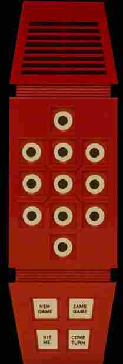

Merlin for Java
-
Currently "Magic Square", "Music Machine" and "TicTacToe" are implemented. 
You need to have JRE >= 8 installed. 
Then simply invoke the jar file and Merlin appears 
as we would live in the good old 1970s. 
To start the game click "New Game" and then 5, 2 or 1. 
The other games are coming soon.  

The original user guide can be found here: https://archive.org/stream/manuals-handheld-games-ParkerBros-Merlin/ParkerBros-Merlin_djvu.txt

Right click in the Merlin window also shows the user guide.

